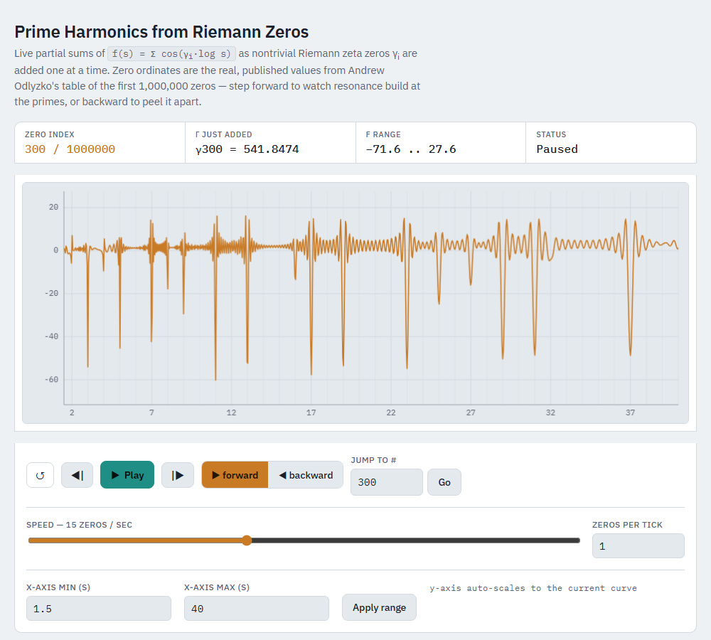

# Prime Harmonics from Riemann Zeros



An interactive HTML visualization of Riemann's explicit formula in action: step forward or backward through real, published nontrivial Riemann zeta zeros and watch the partial sum

```
f(s) = Σ cos(γᵢ · log s)
```

resolve into resonant spikes at the primes and prime powers as more zeros (γᵢ) are added.

## What it shows

Each nontrivial zeta zero ρᵢ = 1/2 + iγᵢ contributes one cosine wave of frequency γᵢ (in log s). Individually these waves look like noise. Summed together, they constructively interfere at exactly the primes and prime powers — a live, hands-on demonstration of why the zeros of ζ(s) are said to "encode" the primes (Riemann's explicit formula).

## Features

- **1,000,000 real zeta zero ordinates**, sourced directly from Andrew Odlyzko's published tables (`zeros6`, rounded to 6 decimal places to fit the file size budget) — not approximated or computed locally.
- **Step forward / backward** through the zero list one at a time (or in configurable batches), with each step exactly adding or subtracting one `cos(γᵢ · log s)` term.
- **Adjustable playback speed** (log-scaled slider, zeros/sec) and a **zeros-per-tick** control for fast-forwarding through the list.
- **User-defined x-axis range** (s-min / s-max; minimum is floored at 1.5), with an auto-scaling y-axis.
- **Jump-to-index** control to skip directly to any zero in the list.
- Live readouts: current zero index, the γ value just added, current f-range, and playback status.
- CSS and all interaction/plotting logic are inline in the HTML file; the 1,000,000 zero values live in a separate data file (`riemann_zeros_data.js`, ~13 MB) that the page loads via a plain `<script src>` tag. The only external network dependency is the Google Fonts stylesheet (IBM Plex Sans/Mono); the zero data and all logic work fully offline with a system-font fallback.

## Usage

Keep `prime_harmonics_from_riemann_zeros_v1.0.html` and `riemann_zeros_data.js` in the same folder, then open the `.html` file directly in any modern browser (double-click it, `file://` it, or serve both from any static file server) — no build step, no server required. The HTML file won't render the trace correctly without `riemann_zeros_data.js` sitting alongside it.

- **▶ Play / ❚❚ Pause** — start/stop stepping through the zero list.
- **◀| / |▶** — step one zero backward / forward manually.
- **▶ forward / ◀ backward** — set which direction Play advances in.
- **Jump to #** — go directly to a specific zero index (0–1,000,000).
- **Speed slider** — set how many zeros are added per second while playing.
- **Zeros per tick** — batch multiple zeros per step/tick, for quickly traversing large ranges.
- **x-axis min/max + Apply range** — change the window of s being plotted; the curve is recomputed from scratch for the new range.
- **↺** — reset back to zero terms summed.

## Data source

Zero ordinates: Andrew Odlyzko, *Tables of zeros of the Riemann zeta function*, https://www-users.cse.umn.edu/~odlyzko/zeta_tables/ (table `zeros6`, first 1,000,000 of 2,001,052 zeros, values rounded to 6 decimal places for this build).

## Version

**v1.0** — initial release: 1,000,000-zero dataset, forward/backward stepping, adjustable speed, user-defined x-axis with a 1.5 floor, 50-division gridlines.

## License

MIT — see [LICENSE](LICENSE).
